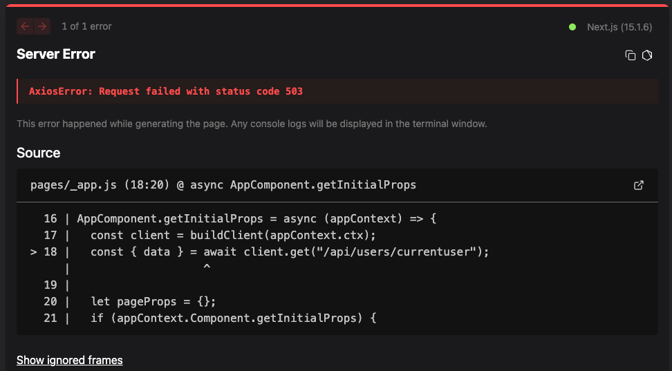

# Microservices-Based Ticketing Platform

## Overview

A scalable event-ticketing platform built with **microservices** to handle ticket creation, ordering, payments, and expiration. Built with Node.js, Docker/Kubernetes, and event-driven architecture (NATS Streaming), it ensures real-time communication between services like Auth, Orders, and Payments. Features include Stripe payments, JWT authentication, and a Next.js/React frontend with server-side rendering (SSR)

## Key Features

- **Frontend**: Next.js/React with SSR for optimized performance. TypeScript for type safety; dynamic routing and client-side hooks (useRequest) for API interaction.

- **Backend & Database**: Node.js/Express microservices (Auth, Orders, Payments, Posts) with TypeScript. MongoDB for data storage; Mongoose models with optimistic concurrency control (OCC) to resolve race conditions.
- **Event-Driven**: NATS Streaming for async communication between services. Publishers/Listeners with queue groups, manual ACKs, and event versioning for concurrency. Redis/Bull for delayed job processing (e.g., order expiration).
- **DevOps & Deployment**: Docker containerization and Kubernetes orchestration (Pods, Deployments, Services). Skaffold for development workflows; Ingress-Nginx for routing and Secrets for secure key storage. GitHub Actions CI/CD for automated testing.
- **Testing**: Jest unit/integration tests for services, and listeners/publishers; automated with GitHub Actions CI/CD.

- **Security & Integrations**: JWT/cookie-based auth with Kubernetes Secrets for secure token storage. Stripe API for payment; test workflows with mock credit cards.

## How to use

- clone this repo to local
- create an `.env` file inside parent folder and add `STRIPE_KEY=[sk_test_...]`, whose value is a [Stripe secret key](https://dashboard.stripe.com/apikeys)
- run ` kubectl create secret generic stripe-secret --from-literal=STRIPE_KEY=[sk_test_...]`, whose value is a [Stripe secret key](https://dashboard.stripe.com/apikeys).

For testing each service: run `npm run test` inside `auth`, `client`, `payments`, `orders`, `tickets`.

For development: Run `skaffold dev` inside parent folder, locally. Create a new branch such as `dev`, and modify the code and push the change to remote. After that, create a PR, it will trigger GitHub Actions to test all the services.

For production: First purchase a domain name, deploy it on Digital Ocean (need to add Digital Ocean token to github repo secret), change the hostname inside yaml file.

## TODO

- Deployment issue: After deploying to DigitalOcean, i always get, don't know how to solve it ヽ(｀ ⌒´)ノ. `AxiosError: Request failed with status code 503`

